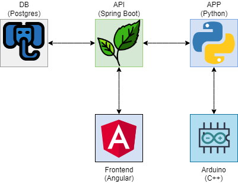

# Medication Dispenser

A simple way to track your medication using a REST API and an Arduino. :robot: :pill:

- [x] Started the project. :heavy_check_mark:
- [x] Arduino System do dispense medication. :heavy_check_mark:
- [x] Read info from serial port and save to database. :heavy_check_mark:
- [x] Backend that fetches data from the database. :heavy_check_mark:
- [ ] Create Docker environments for API, database, database and frontend.
- [ ] Fronted that fetches data from the backend. :x:

